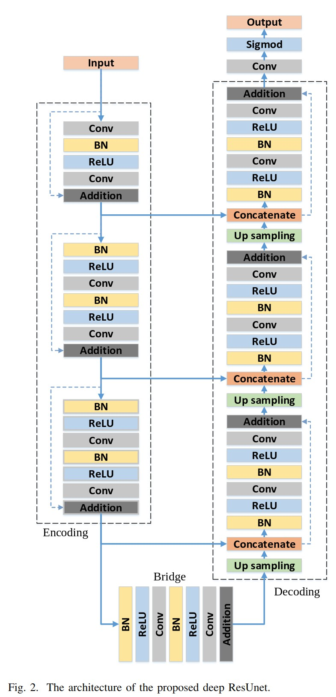

# Keras implementation of Deep Residual U-Net

The architecture was inspired by [Road Extraction by Deep Residual U-Net](https://arxiv.org/pdf/1711.10684.pdf)

## Overview

### Data

Data should be prepared in the PASCAL VOC annotation way. For more information see docsting of PASCALVOCIterator class 
(utils.py) 

### Pre-processing

For preprocessing you could use standart keras utils for image preprocessing (keras.preprocessing.image)

## Model

The architecture of the model based on the [Road Extraction by Deep Residual U-Net](https://arxiv.org/pdf/1711.10684.pdf).
Image below illustrates it.

## How to use

### Train

In order to train model you could use train.py file. 
First of all you need to specify input_shape, dataset_folder and classes variables and then run train.py 

### Dependencies
This implementation depends on following libraries:

* Tensorflow
* Keras == 2.1.2 (probably >= 2.1.2)

